# Clear Cut Photo Editor

A free browser-based photo editor with AI background removal, colour adjustments, shadows, crop and batch export — plus a **Collage** mode for combining multiple images into a single layout.

**[Click here to use the editor](https://lonesoulsurfer.github.io/clear-cut-photo-editor/)**

This photo editor was built to make batch changes on images simple and easy. Primarily — I made it so I could batch process images for Instructables builds. However, it's a great tool to use for individual images as well.

The 2 highlights in this editor are the background removal and adding shadows to images. Once the background has been removed, you can pick the colour you want or have it transparent.

There are multiple controls to help with adjusting the image so it looks just right. Again, these are simple to use and you can also add a preset to your favourite adjustments to use in other editing projects.

I've kept the tools to a minimum and have made a concerted effort not to include any controls that just waste space or are hardly ever used.

Below is a how to use the editor with images — enjoy and let me know if you find any bugs or if I am missing any controls you think essential.

---

## Getting Started

1. Click the link at the top of this page to open the editor, or open `index.html` directly in any modern browser (Chrome recommended for full File System Access support)
2. Drop images onto the left panel, or click the drop zone to browse
3. Edit and export — everything stays in your browser, nothing is uploaded

---

## Session

When you open the editor you'll be prompted to start a new session or resume a previous one.

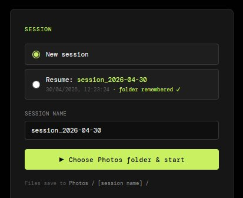

- **New session** — starts fresh with a clean workspace. Give it a name or leave the default (auto-named by date)
- **Resume** — picks up where you left off, including the folder you were working from
- Click **Choose Photos folder & start** to select your working folder and begin

Files are saved to `Photos / [session name] /` inside the folder you choose.

---

## Loading Images

Click or drag photos directly onto the drop zone in the preview area. Supports JPG, PNG, and WebP. You can load multiple images at once.

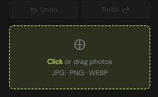

Once loaded, images appear in the **filmstrip** at the bottom of the preview. Click any thumbnail to switch to it. Hover a thumbnail to reveal the **✕** remove button.

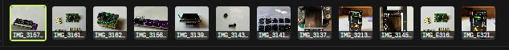

> **Tip:** When you add new images, any slider adjustments you've already made are automatically inherited by the new images.

Here's an example of a finished edit — background removed, shadow added, and adjustments dialled in:

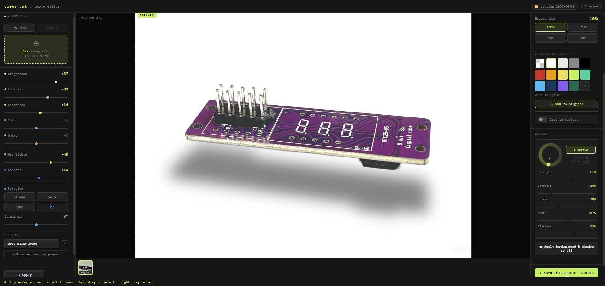

---

## Adjustment Controls

The right panel contains all tone and colour controls.

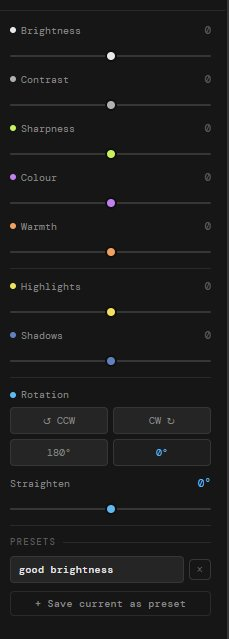

| Slider | What it does |
|---|---|
| **Brightness** | Overall exposure — push up to lift shadows, pull down to darken |
| **Contrast** | Separation between lights and darks |
| **Sharpness** | Edge crispness — useful for product shots |
| **Colour** | Saturation — pull left to desaturate, push right to boost |
| **Warmth** | Colour temperature — orange/warm vs blue/cool |
| **Highlights** | Recover blown highlights or push them brighter |
| **Shadows** | Lift or crush the shadow areas independently |

All sliders default to `0`. The value badge turns accent-coloured when a slider is active.

### Rotation & Straighten

Below the sliders, four buttons handle **90° rotation** (CCW, CW, 180°, reset to 0°). The **Straighten** slider fine-tunes tilt from −45° to +45°.

### Presets

Save your current slider state as a named preset so you can reuse it across projects.

1. Dial in the adjustments you want
2. Type a name in the preset field and click **+ Save current as preset**
3. Click any saved preset to instantly apply it to the current image
4. Click **×** on a preset to delete it

Presets are saved to your browser's local storage and persist between sessions.

### Apply to All & Reset

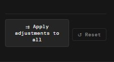

- **Apply adjustments to all** — copies the current image's slider settings across every image in the session
- **Reset** — zeros out all sliders and rotation for the current image

### Undo / Redo

Each image has its own undo/redo history. Use the **Undo** and **Redo** buttons above the drop zone.

---

## Background Colour

Choose what background to place behind a subject after background removal.

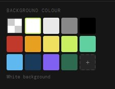

Pick from the preset swatches (including transparent), or click the **+** tile to choose a custom colour. The label below the swatches shows your current selection.

---

## Shadow

After background removal, the Shadow panel lets you add a realistic drop shadow.

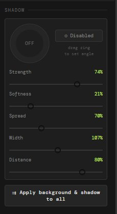

- Drag the **angle dial** to set the light direction
- Click **Disabled** to toggle the shadow on or off
- Adjust the sliders to refine the look:

| Slider | What it does |
|---|---|
| **Strength** | Opacity of the shadow |
| **Softness** | How blurred/feathered the edges are |
| **Spread** | How far the shadow extends outward |
| **Width** | Horizontal scale of the shadow |
| **Distance** | How far the shadow is offset from the subject |

Click **Apply background & shadow to all** to push these settings across every image in the session.

---

## Export & Output

The left panel controls canvas size and export resolution.

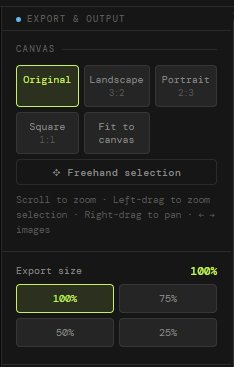

**Canvas** — choose the output aspect ratio:
- **Original** — keeps the image's native dimensions
- **Landscape 3:2 / Portrait 2:3 / Square 1:1** — crops to a standard ratio
- **Fit to canvas** — fits the image within the canvas without cropping
- **Freehand selection** — drag to define a custom crop region

**Export size** — set the output resolution at 100%, 75%, 50%, or 25% of the canvas size.

---

## Mouse Controls

Use your mouse to navigate and crop within the preview area.

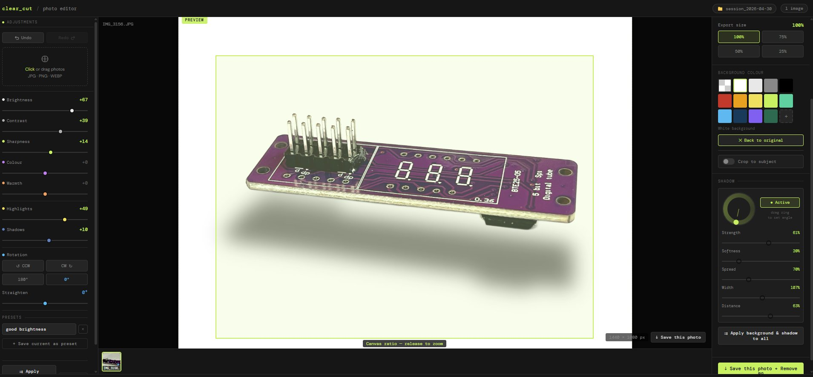

| Action | How |
|---|---|
| **Zoom in / out** | Scroll wheel over the preview |
| **Pan** | Right-click and drag |
| **Freehand crop selection** | Left-click and drag to draw a crop region |
| **Zoom to selection** | Left-drag then release — the canvas zooms to fit your selection |
| **Next / Prev image** | Hover the left or right edge of the preview for arrow navigation |

> **Tip:** When in freehand selection mode, the canvas ratio tooltip at the bottom shows the pixel dimensions of your selection as you drag. Release to confirm the crop.

---

## Saving

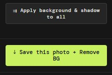

- **Save this photo + Remove BG** — exports the current image with all adjustments and background removal applied
- **Save all photos** — batch exports every image in the filmstrip; a progress bar tracks the queue

Exports are saved directly to your session folder. If background removal was applied, images export as PNG to preserve transparency (unless a solid background colour was chosen).

---

## Collage Mode

Collage mode lets you combine multiple images into a single composed layout — with the same adjustment, background removal, and shadow controls available per slot.

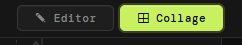

Switch between **Editor** and **Collage** using the tabs at the top of the screen.

---

### Choosing a Layout

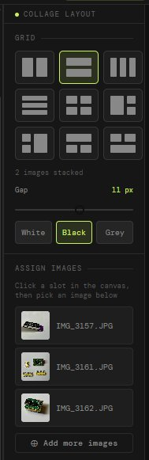

The left panel shows a grid of layout options — from simple 2-image side-by-side or stacked arrangements up to 4-image grids and asymmetric hero layouts. Click any layout icon to switch. The description below the grid tells you what the selected layout produces (e.g. *2 images stacked*, *2×2 grid (4 images)*).

**Gap** — use the slider to control the spacing between slots in pixels.

**Background colour** — the White / Black / Grey buttons set the gap and border colour. This is the colour shown between and around your images.

---

### Assigning Images to Slots

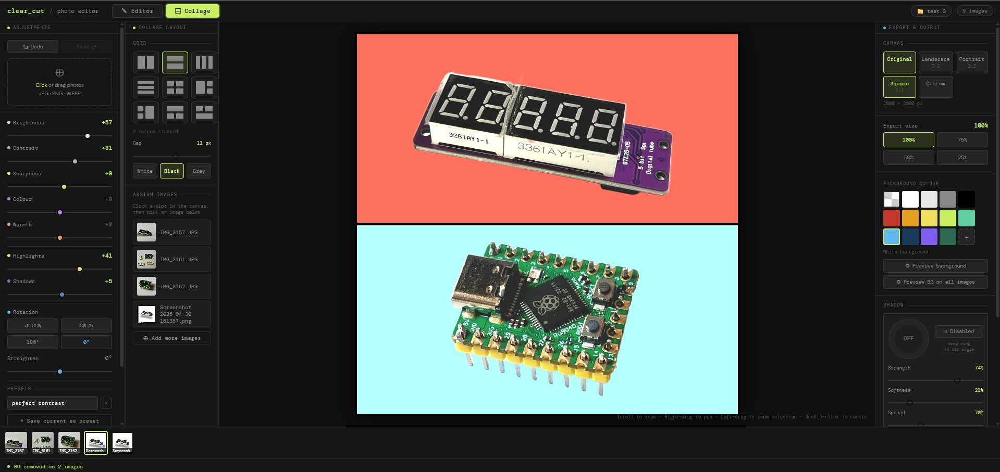

Images from your filmstrip are used directly — there's no separate import step for collage.

1. **Click a slot** in the canvas to select it (it highlights with a coloured border)
2. **Click a thumbnail** in the filmstrip at the bottom — the image is assigned to that slot
3. Repeat for each slot in the layout

> **Tip:** When a slot is selected, the filmstrip thumbnails glow to indicate they're ready to assign.

Once assigned, you can **scroll to zoom** and **right-drag to pan** within each slot to frame the image exactly how you want it.

---

### Adjustments Per Slot

Each slot has its own independent adjustment settings. Select a slot and use the left panel sliders — Brightness, Contrast, Sharpness, Colour, Warmth, Highlights, Shadows — exactly as in the editor. Changes only apply to the selected slot.

---

### Background Removal in Collage

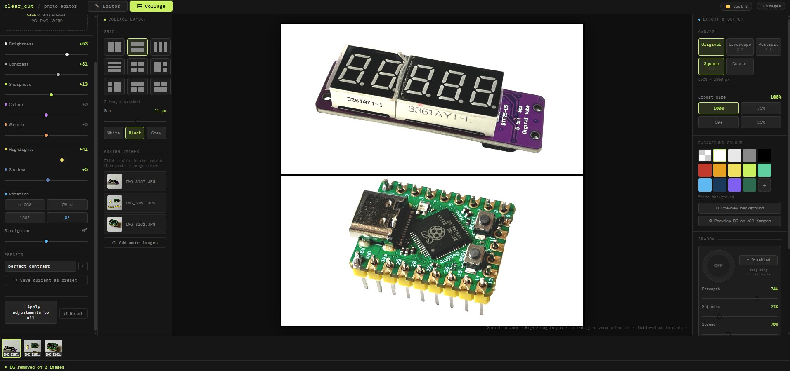

The right panel in collage mode includes the same **Background Colour** and **Shadow** controls as the editor, applied per slot.

- **Preview background** — removes the background on the selected slot and applies the chosen colour
- **Preview BG on all images** — runs background removal across every assigned slot in one pass. Slots that have already had their background removed are skipped automatically — only new slots are processed

You can give each slot a different background colour, making it easy to create product shots with varied or branded backgrounds in a single export.

---

### Shadows in Collage

Shadow settings work identically to the editor — drag the angle dial, toggle on/off, and adjust Strength, Softness, Spread, Width and Distance. Shadow settings are per-slot and stored independently.

Click **Apply background & shadow to all** to push the current slot's shadow and background settings across every slot in the collage.

---

### Canvas Size & Export

The right panel **Canvas** and **Export size** controls work the same as in the editor — choose Square, Landscape, Portrait, or a custom pixel size, then set the export resolution.

- **Save collage** — exports the full composed layout as a single JPEG (or PNG if any slot uses a transparent background)
- **Save collage (keep all BGs)** — exports with all adjustments applied but skips background removal, preserving the original backgrounds on every slot

---

### Start Over

The **Start over (keep images)** button at the bottom of the left panel resets the entire collage — all slot assignments, adjustments, background removals and shadows are cleared. Your loaded images stay in the filmstrip ready to re-assign.

To reset a single slot only, select it and click **Reset**.
